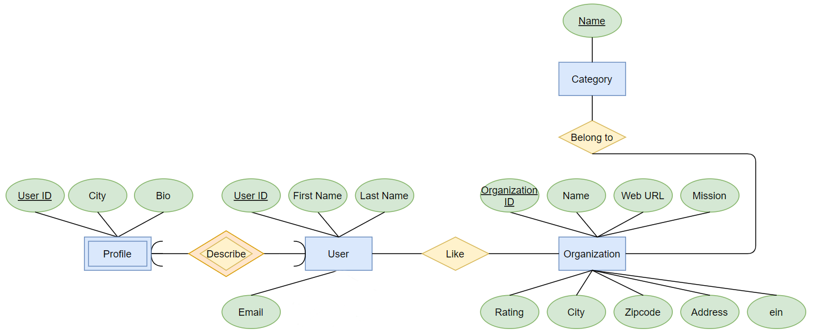
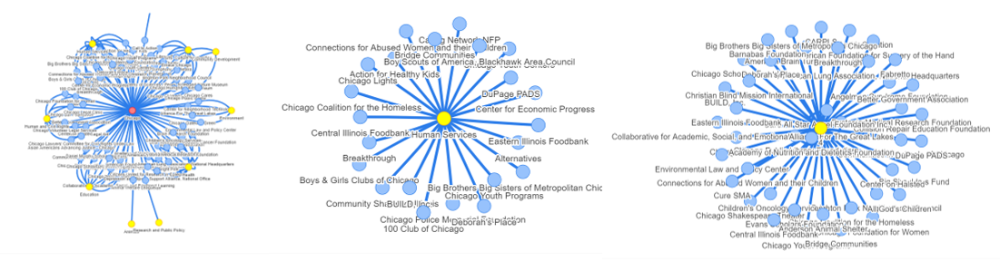

# WhereInNeed
Where In Need! is a charity web app focusing on charities in Illinois, helpingthe potential donors to target the organizations according to its location, categoryor description. There are multiple scenarios regarding the donating motivation.The app provides search engine in which you can search organizations by name,city, category and description. Also, the app has a sidebar upon which one can classify charities based on its city/category/rating, and once you click theorganization you are interested, the web page will show a network around the given organization, according to the city/category/rating. Moreover, on this webapp, one can edit his/her own profile by change their personal information orchange password. A user can like or unlike a charity on the charity detail page,and the liked charities will be displayed on the user profile. Also once the userliked an organization, a list(5) of recommended organization with top likes wouldbe shown based on its category

# ER Diagram and Schema

The Figure below shows the ER Diagram for database design. There are four tables, User, Profile, Organization and Category, the schema for each table is shown in figure 2. The Profile is a weak entity for User, it describes user’s city and bio, the relationship is one-to-one. The relationship between User and Organization is whether a user likes an organization, a user can like many organizations and an organization can be liked by many users. The relationship between Organization and Category is an organizationbelongs to at least one categories and a category has many organizations.

# Data and Source

The data in databases has two main parts.  One is the charity data, another the userdata.  The charity data has 100 instances including features like id, name, mission, city, zip code, address, URL and rating. All data is real and true from Charity NavigatorAPI [1]. We used python to read the data we needed and saved locally. Also we added all the data into docker to make interactions more convenient. The charity data areused in SQL database as well as NoSQL database. Apart from the charity data, we also have a category table serves as a many-to-many relationship between the charities and the categories. A like table, records all the likes and dislikes users have made.There are 2 tables for the user data. First is the build-in user table, recording thesign-ups and the deletes. The table includes id, username, email, first name, last name. Also we simulated 25 records of users read in this table.  Another is the profile table,one-to-one with the user table, contains the other personal information such as bio andcity.

# Fuctionality

* User can sign up an account and login with existed accounts.  User can log out ordelete account in profile page
* User can go through profile page and update personal information including user-name, email, first name, last name, city and bio
* User can search for interested charities by charity name, city or category on mainpage
* User can go through a charity detail page and read information about charities.Website will recommend top three liked charities in the same category on charitydetail page
* User can like or unlike a charity, and can go through all charities like in profilepage
* User can look up charities by city or by rating.  When user look up charities bycity, website provides a graph visualization for all charity in that city.  When userlook up charities by rating, website provides a graph visualization for all charityrated the same score

## basic function
The project realizes basic functions to delete and insert records of whether a userlikes a charity. The project realizes update function for user profile update.  On the userprofile page, user can modify city, bio, email and name. Once user make changes to theseattributes, user click on `Save` button and web page will refresh and display the latestuser profile. All changes user made via web page will lead to the according attributesmodification in database.  For instance, if user modify his city from "Champaign" to "Urbana", the data record for this user will change. The `city` attribute for that userrecord is modified from "Champaign" to "Urbana".  
## advanced function
Like function serves as trigger in this project.  When a user clicks the like button,the function is triggered.  When the user in the like table already exists, apply deletion, otherwise, apply insertion. The like table links charity data and user data. The function is `before insert` and `delete cascade`. On a charity detail page, if user click on `like` button, database will insert a like relation between this user and charity, and `like` button on that page will change to `unlike`, user can find this liked organizationdisplayed on profile detail page. If user click on `unlike` button, database will delete alike relation between this user and charity, and `unlike` button on that page will change to `like`, user can find previous liked organization disappeared from profile detail page.

Here we use Neo4j as our NoSQL database. This advance function can help us better visualize the relationship among organizations, city and category. When user clicks on different cities, the organizations located at this specific city will show up; when user clicks on different categories, the organizations in this category will show up.

# NoSQL implementation
Here we use a noSQL database, to be specific, Neo4j to store the charity organiza-tion information. Compared with the relational database, Neo4j is regarded as a highperformance graph store in which the data is stored as nodes connected by different relationships. A powerful graph query language-Cypher is an important assistance of Neo4j DBMS. Using a Neo4j database to store the Charity data provides a better visualization to reflect the distribution of organizations. As show in fig3, We can easily answer the following questions: What organizations are around a given city? What types of organizations are in the majority in a given city? Which organizations are in a particular category? Which organizations are in a specific rating level. We use relational database to store the user and charity data. Because relational database iswidely used and it is easy to show the data in a tabular form.

# dataflow
Here we detail the dataflow from frontend to backend for our website.  We describethe dataflow according to different functions includes user registration, keyword search-ing and charity recommendation.
## Registration and login
Clients inputs username, password, email et al. to the form in register page, the data will be sent to a mysql database: `my-app-db` and add a new row in the `auth-user` table and the `myapp-profile` table.  User can update the profile from frontend and the information fill in the profile form will be update to `myapp-profile` table and `auth-user`. When the user open the user profile, the frontend will query the information from `auth-user` table, the `myapp-profile` table and the `myapp_charity_likes` table, and the backend will send back the user information.
## Searching
Users can search in the search bar in our website.  Then the query will be sent tothe backend and the mysql DBMS will send back the information relates to the searchwords we enter.
##  Charity recommendation
User can like or unlike the organizations in the organizations detail page.  Then the `myapp_charity_likes` table will add or delete the related row. When the user enters or refreshes a organization detail page, the frontend will send a query and the backendwill send back the organizations with highest like clicks and in the same category.

# Reference
[1]  Charity Navigator’s API. Retrieved from https://www.charitynavigator.org
