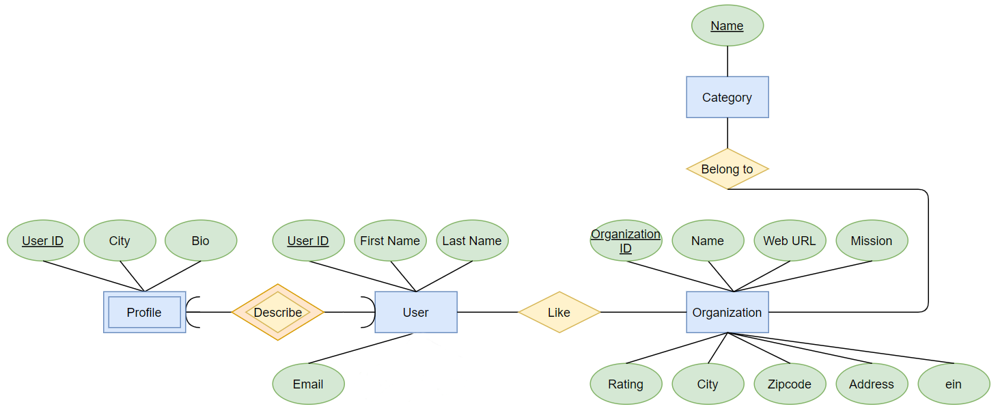
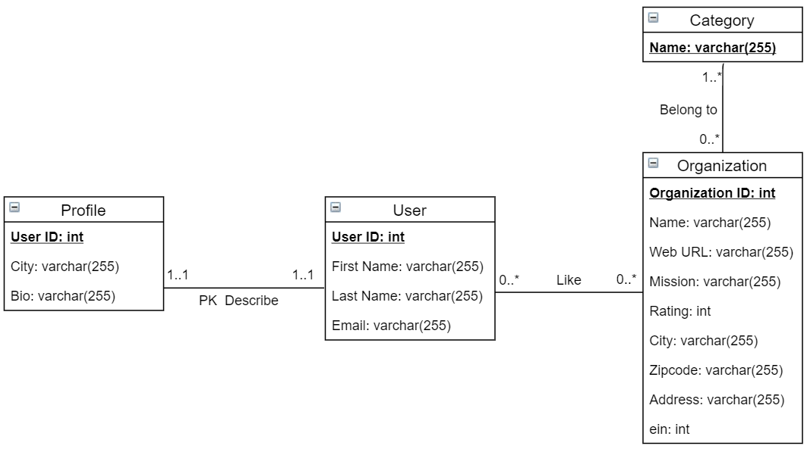

# WhereInNeed
Where In Need! is a charity web app focusing on charities in Illinois, helpingthe potential donors to target the organizations according to its location, categoryor description. There are multiple scenarios regarding the donating motivation.The app provides search engine in which you can search organizations by name,city, category and description. Also, the app has a sidebar upon which one can classify charities based on its city/category/rating, and once you click theorganization you are interested, the web page will show a network around the given organization, according to the city/category/rating. Moreover, on this webapp, one can edit his/her own profile by change their personal information orchange password. A user can like or unlike a charity on the charity detail page,and the liked charities will be displayed on the user profile. Also once the userliked an organization, a list(5) of recommended organization with top likes wouldbe shown based on its category

The Figure below shows the ER Diagram for database design. There are four tables, User, Profile, Organization and Category, the schema for each table is shown in figure 2. The Profile is a weak entity for User, it describes user’s city and bio, the relationship is one-to-one. The relationship between User and Organization is whether a user likes an organization, a user can like many organizations and an organization can be liked by many users. The relationship between Organization and Category is an organizationbelongs to at least one categories and a category has many organizations.

